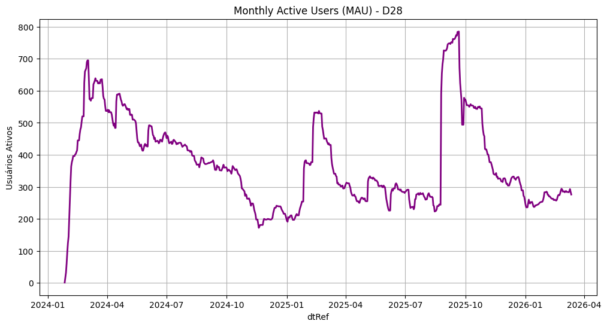

<!-- omit in toc -->
# Loyalty Predict Project

Projeto de Ciência de Dados realizado por Eduardo Ferreira da Silva. 

<!-- omit in toc -->
## 📚 Sumário
- [📌 Visão Geral do Projeto](#-visão-geral-do-projeto)
- [🤔 Definição do problema](#-definição-do-problema)
- [🧰 Ferramentas Utilizadas](#-ferramentas-utilizadas)
- [💼 Entendimento do Negócio](#-entendimento-do-negócio)
- [📊 Entendimento dos Dados](#-entendimento-dos-dados)
  - [Análise de Engajamento](#análise-de-engajamento)
  - [Principais Insights](#principais-insights)
- [🛠️ Preparação dos Dados](#️-preparação-dos-dados)
  - [Metodologia RFV e Ciclo de Vida](#metodologia-rfv-e-ciclo-de-vida)
  - [Segmentação de Clientes](#segmentação-de-clientes)
  - [Feature Stores](#feature-stores)
    - [🔄 Ciclo de Vida](#-ciclo-de-vida)
    - [💳 Transacional](#-transacional)
    - [🎓 Plataforma de Cursos](#-plataforma-de-cursos)
  - [Pipeline de Dados](#pipeline-de-dados)
  - [Construção da ABT](#construção-da-abt)
- [👨🏻‍🔬 Modelagem](#-modelagem)
  - [Sample](#sample)
  - [Explore](#explore)
  - [Modify](#modify)
  - [Model](#model)
  - [Assess](#assess)
- [🩺 Avaliação](#-avaliação)
  - [Impacto no Negócio](#impacto-no-negócio)
  - [Limitações](#limitações)
- [🚀 Deploy](#-deploy)
- [🖥️ Como Utilizar](#️-como-utilizar)
- [🔚 Conclusão](#-conclusão)


## 📌 Visão Geral do Projeto
Bem vindo ao meu projeto de predição de fidelidade de clientes utilizando dados do canal Teo Me Why da Twitch. 

Nele o **objetivo** foi construir uma **Tabela Base Analítica** (ABT) e um **modelo** de ***machine learning*** para realizar **predições** sobre a **probabilidade** de um **cliente** se tornar **fiel** nos 28 dias seguintes a uma data específica.

Para construir e orquestrar essas predições foram utilizadas, principalmente, *scripts* **Python**, consultas em **SQL** e conhecimentos de **Estatística** e **Aprendizado de Máquina**.

Para o desenvolvimento do projeto foi utilizada a metodologia *Cross-Industry Standard Process for Data Mining* (CRISP-DM) que estabelece 6 etapas: 
1. Entendimento do Negócio;
2. Entendimento dos dados;
3. Preparação dos dados;
4. Modelagem;  
5. Validação;
6. Implementação do projeto e acompanhamento.

Além disso, dentro da etapa de modelagem utilizou-se a metodologia *Sample-Explore-Modify-Model-Assess* (SEMMA) desenvolvida pela empresa SAS.

## 🤔 Definição do problema

A principal questão a ser respondida neste projeto é:

> Qual a probabilidade de um cliente se tornar fiel nos próximos 28 dias?

**Definição de cliente fiel:** cliente que realizou ao menos uma transação nos últimos 7 dias, considerando uma data de referência.

## 🧰 Ferramentas Utilizadas

Para construção da ABT e do modelo de predição de fidelidade, foram utilizadas as seguintes ferramentas:

- **SQL**: análise dos dados e construção das *features* e da Tabela Base Analítica (ABT);

- **Python**: orquestração do pipeline de dados, treinamento dos modelos e disponibilização das previsões via API.

Principais bibliotecas utilizadas:

- **Pandas**: manipulação e preparação dos dados;
- **SQLAlchemy**: conexão e consulta aos bancos de dados;
- **Scikit-learn**: modelagem e avaliação dos algoritmos;
- **Feature-engine**: transformação e tratamento das *features*;
- **MLflow**: rastreamento e versionamento dos experimentos;
- **Flask**: construção da API para predição;
- **Requests**: consumo da API;
- **Matplotlib** e **Seaborn**: visualização de dados.

Foram utilizados modelos baseados em árvores para classificação:
- **Decision Tree**;
- **Random Forest**;
- **AdaBoost**.

## 💼 Entendimento do Negócio

O ecossistema Teo Me Why envolve um sistema de pontos baseado no engajamento dos usuários nas transmissões ao vivo na Twitch e na plataforma de cursos.

Os usuários acumulam pontos por meio de interações como participação em lives, consumo de conteúdo e realização de cursos, podendo utilizá-los para adquirir benefícios dentro do ecossistema.

O engajamento dos usuários, no entanto, apresenta variações ao longo do tempo, o que torna relevante a identificação de clientes com maior propensão a se tornarem fiéis.

Neste contexto, o objetivo do projeto é prever a probabilidade de um cliente se tornar fiel, permitindo apoiar estratégias de retenção e aumento de engajamento nas transmissões.

## 📊 Entendimento dos Dados

Os dados foram disponibilizados em formato relacional e analisados com SQL (SQLite), sendo organizados em duas fontes principais:

- **Sistema de Pontos**: transações e interações dos usuários;  
    - Link: [https://www.kaggle.com/datasets/teocalvo/teomewhy-loyalty-system](https://www.kaggle.com/datasets/teocalvo/teomewhy-loyalty-system).
- **Plataforma de Cursos**: progresso e engajamento educacional;
    - Link: [https://www.kaggle.com/datasets/teocalvo/teomewhy-education-platform](https://www.kaggle.com/datasets/teocalvo/teomewhy-education-platform).

### Análise de Engajamento

Para avaliar o comportamento dos usuários ao longo do tempo, foram utilizadas as métricas:

- **DAU (Daily Active Users)**;
- **MAU (Monthly Active Users - janela de 28 dias)**.

O MAU foi priorizado por fornecer uma visão mais estável do engajamento.

📄 Consulta em SQL para construção do MAU: [src/analytics/mau.sql](src/analytics/mau.sql).



📄 *Script* completo em Python para construção do gráfico: [src/analytics/dau_mau_graphs.py](src/analytics/dau_mau_graphs.py). 

---

### Principais Insights

- Picos de engajamento ocorrem em períodos com cursos e projetos; 
- Há uma **tendência de queda** entre mar/2024 e ago/2025;
- O aumento posterior sugere impacto pontual de iniciativas específicas;  
- Nova queda indica dificuldade de retenção no longo prazo.  

Diante desse cenário, torna-se relevante identificar usuários com maior propensão à fidelidade, permitindo ações direcionadas para aumentar o engajamento e recorrência.

## 🛠️ Preparação dos Dados

Nesta etapa foi construída a **Tabela Base Analítica (ABT)**, consolidando diferentes fontes e representações do comportamento dos clientes.

### Metodologia RFV e Ciclo de Vida

Inicialmente, foram utilizadas as métricas **Recência, Frequência e Valor (RFV)** para caracterizar o comportamento dos usuários:

- **Recência**: tempo desde a última ativação  
- **Frequência**: volume de interações  
- **Valor**: intensidade das transações  

A partir dessas métricas, foi desenvolvido um **modelo de ciclo de vida**, classificando os clientes em estados como:

- Curioso, Fiel, Turista, Desencantado e Zumbi  
- Estados de transição: Reconquistado e Reborn  

Essa abordagem permite capturar a **dinâmica temporal do engajamento** dos usuários.

📄 Implementação completa: [src/analytics/life_cycle.sql](src/analytics/life_cycle.sql)

---

### Segmentação de Clientes

Para aprofundar a análise dentro de cada estágio do ciclo de vida, foi aplicada uma segmentação baseada em **Frequência e Valor**.

Utilizando **K-Means**, os clientes foram agrupados em perfis comportamentais, como:

- Alta frequência vs alto valor  
- Baixa frequência vs baixo valor  

Essa segmentação complementa o ciclo de vida, permitindo uma visão mais granular do comportamento dos usuários.

📄 Código: [src/analytics/frequencia_valor.py](src/analytics/frequencia_valor.py)

---

### Feature Stores

Foram desenvolvidas três *feature stores*, cada uma capturando diferentes dimensões do comportamento:

#### 🔄 Ciclo de Vida
- Estado atual e histórico do cliente  
- Distribuição temporal entre estágios  
- Comparação com média do grupo  

📄 Consulta: [src/analytics/fs_life_cycle.sql](src/analytics/fs_life_cycle.sql).

#### 💳 Transacional
- Atividade em múltiplas janelas (D7, D14, D28, D56)  
- Volume, frequência e intensidade de transações  
- Recorrência e padrões de comportamento  

📄 Consulta: [src/analytics/fs_transacional.sql](src/analytics/fs_transacional.sql).

#### 🎓 Plataforma de Cursos
- Progresso em cursos  
- Engajamento em cada curso  
- Tempo desde última atividade  

📄 Consulta: [src/analytics/fs_education.sql](src/analytics/fs_education.sql).

Essa separação permite maior **escalabilidade** na construção da ABT.

---

### Pipeline de Dados

Foi desenvolvido um pipeline em Python para orquestrar a construção das *feature stores*.

O pipeline:
- Executa consultas SQL parametrizadas por data  
- Processa múltiplas tabelas de forma padronizada  
- Persiste os resultados no banco analítico  

Essa abordagem permite atualização contínua e reprodutível dos dados.

📄 Script: [src/analytics/exec_query.py](src/analytics/exec_query.py)

---

### Construção da ABT

A ABT foi construída a partir da junção das *feature stores*, considerando múltiplas datas de referência por cliente.

Principais decisões:

- Amostragem aleatória de datas por cliente  
- Remoção de clientes inativos extremos (Zumbis)  
- Criação da variável target:

> Cliente será fiel após 28 dias?

A variável target recebe:
- **1**: cliente se torna fiel  
- **0**: caso contrário  

Essa estrutura permite capturar o problema como uma tarefa de **classificação supervisionada temporal**.

📄 Consulta completa: [src/analytics/target.sql](src/analytics/target.sql)

## 👨🏻‍🔬 Modelagem

A etapa de modelagem foi estruturada com base na metodologia **SEMMA (Sample, Explore, Modify, Model, Assess)**, garantindo organização, reprodutibilidade e consistência entre treino e inferência.

📄 O código completo está disponível em:  
[src/analytics/train.py](src/analytics/train.py)

---

### Sample

Os dados foram divididos em três conjuntos:

- **Treino/Teste**: dados anteriores entre `2024-03-01` e `2025-10-01`
- **Out-of-Time (OOT)**: dados de `2025-10-01`, `2025-11-01` e `2025-12-01`

A base OOT foi utilizada para simular um cenário real de produção, avaliando a estabilidade temporal do modelo.

A divisão treino/teste foi feita com estratificação da variável target:

```python
X_train, X_test, y_train, y_test = model_selection.train_test_split(
    X, y,
    test_size=0.2,
    random_state=42,
    stratify=y
)
```

---

### Explore

Foi realizada uma análise bivariada para avaliar o poder discriminativo das variáveis:

- **Numéricas**: comparação da mediana entre classes (fiéis vs não fiéis);
- **Categóricas**: taxa média de fidelidade por categoria.

Além disso, analisou-se uma análise das *features* com valores faltantes. 

Com base nessas análises:

- Variáveis com baixo poder discriminativo foram marcadas para remoção;
- Foram identificadas estratégias adequadas de imputação para valores faltantes.

### Modify

As transformações aplicadas incluíram:

- Conversão de variáveis numéricas para `float`;
- Remoção de features sem poder discriminativo (razão entre as medianas das classes = 1);
- Tratamento de valores faltantes:
  - `0`: ausência de atividade;
  - `1`: variáveis de razão (neutralidade);
  - `"Missing"`: variáveis categóricas;
  - `1000`: ausência de recorrência.
- Aplicação de One-Hot Encoding em variáveis categóricas.

---

### Model

Foram testados três algoritmos baseados em árvores:

- **Decision Tree**;
- **Random Forest**;
- **AdaBoost**.

O treinamento foi realizado com **Grid Search** + **Validação Cruzada**, utilizando **AUC-ROC** como métrica principal.

Foi construído um pipeline unificando pré-processamento e modelo:

```Python
model_pipeline = pipeline.Pipeline(steps=[
    ('drop_features', drop_features),
    ('imputations', imputers),
    ('encoding', onehot),
    ('model', grid),
])
```

Além disso, utilizou-se o MLflow para rastreamento de experimentos, permitindo versionamento de modelos e comparação de métricas.

---

### Assess

Os modelos foram avaliados nas bases:

- **Treino**: ajuste aos dados
- **Teste**: generalização
- **OOT**: desempenho em dados futuros

O resultado obtido na comparação das bases utilizando a AUC-ROC foi o seguinte:

|     Modelo    | Treino | Teste  |  OOT   |
|---------------|--------|--------|--------|
| Decision Tree | 0.8648 | 0.8012 | 0.7846 |
| Random Forest | 0.9302 | 0.8462 | 0.8179 |
|    AdaBoost   | 0.8845 | 0.8531 | 0.8250 |

Escolha do modelo:
- **Random Forest** apresentou melhor desempenho em treino, porém com sinais de *overfitting*;
- **AdaBoost** apresentou maior consistência entre treino, teste e OOT;

> 👉 O modelo final selecionado foi o `AdaBoost`, por apresentar melhor capacidade de generalização e estabilidade temporal.

📄 O código completo da etapa de modelagem pode ser encontrado em: [src/analytics/train.py](src/analytics/train.py).

## 🩺 Avaliação

O modelo **AdaBoost** foi selecionado por apresentar o melhor desempenho na base Out-of-Time (OOT), com **AUC-ROC de 0.825**, além de maior consistência entre treino, teste e OOT quando comparado aos demais modelos.

Esse comportamento indica boa capacidade de generalização e maior robustez a variações temporais dos dados.

### Impacto no Negócio

O modelo permite **ordenar clientes por probabilidade de fidelidade**, viabilizando:

- Segmentação de usuários mais propensos a engajar
- Priorização de campanhas e ações de retenção
- Incentivo por meio de pontos para usuários mais engajados;

### Limitações

- O modelo depende de padrões históricos e pode sofrer declínio da capacidade preditiva ao longo do tempo;
- Necessidade de retreinamento periódico para manter a performance;
- Sensibilidade a mudanças no comportamento dos usuários ou no produto.

## 🚀 Deploy

O modelo foi integrado a um pipeline de dados que permite a atualização contínua das *features* e a geração de previsões com base na data mais recente disponível.

A inferência é realizada a partir da tabela `fs_all`, que consolida todas as *features* dos clientes na data de referência mais recente.

As previsões podem ser realizadas de duas formas:

- **Batch (via script)**: utilizando o script `predict_fiel.py`, recomendado para execuções periódicas;
- **Online (via API)**: utilizando a API construída com Flask (`api_fiel.py`), permitindo previsões sob demanda.

Para execução completa do pipeline e geração das previsões, consulte a seção [Como Utilizar](#como-utilizar).

## 🖥️ Como Utilizar

A execução do projeto segue um fluxo sequencial, desde a ingestão de dados até a geração de previsões.

⚠️ Execute todos os comandos a partir da raiz do projeto

1. Ingestão de Dados

Primeiramente, é necessário configurar as credenciais da API do Kaggle.

Crie um arquivo `.env` na raiz do projeto com as seguintes variáveis:

```env
KAGGLE_USERNAME=seu_usuario
KAGGLE_KEY=sua_chave
```

Em seguida, execute o *script* responsável pela coleta e atualização dos dados brutos:

```bash
python src/analytics/get_data.py
```

2. Construção das Feature Stores

Execute o pipeline de criação das feature stores:

```bash
python src/analytics/exec_query.py --table fs_education --db_origin education-platform
python src/analytics/exec_query.py --table life_cycle
python src/analytics/exec_query.py --table fs_life_cycle --db_origin analytics --start 2024-03-01
python src/analytics/exec_query.py --table fs_transacional
```

3. Criação da ABT e Treinamento do Modelo

Antes do treinamento, é necessário executar a consulta SQL responsável pela criação da Analytical Base Table (ABT).

Essa consulta está disponível no arquivo em [src/analytics/target.sql](src/analytics/target.sql) e pode ser executada por meio de um cliente SQL ou via terminal. Exemplo com SQLite:

```bash
sqlite3 data/analytics/database.db < target.sql
```

Após a construção da ABT, abra uma conexão com servidor do `MLflow`:

```bash
mlflow server
```

Na sequência, execute o treinamento dos modelos:
```bash
python src/analytics/train.py
```

Após o treinamento, registre o melhor modelo no servidor do MLflow.

4. Atualização diária do Pipeline

Para atualização contínua dos dados, execute:

```bash
python src/engineering/get_data.py
```

Em seguida, para atualização das *features*, execute:

```bash
python src/analytics/pipeline_analytics.py
```

5. Geração das Previsões

As previsões podem ser realizadas de duas formas:

- Via *script*:

```bash
cd src/analytics/
python predict_fiel.py 
```

-  Via API:

Execute a aplicação web:
```bash
flask --app api_fiel run --port 5001
```

Em seguida, execute:
```bash
cd src/api/
python request_api_fiel.py
```

## 🔚 Conclusão

Este projeto apresentou uma solução de **predição de fidelidade de clientes**, estruturando desde a construção da **ABT** até a modelagem e disponibilização das previsões.

A utilização de técnicas como **RFV**, **ciclo de vida** e *feature engineering* permitiu capturar o comportamento dos usuários ao longo do tempo.

O modelo **AdaBoost** foi selecionado por sua melhor **generalização**, com bom desempenho em dados futuros (*Out-of-Time*).

A solução final, integrada a um **pipeline de dados** e uma **API**, possibilita seu uso em cenários reais de **retenção e engajamento** de clientes.