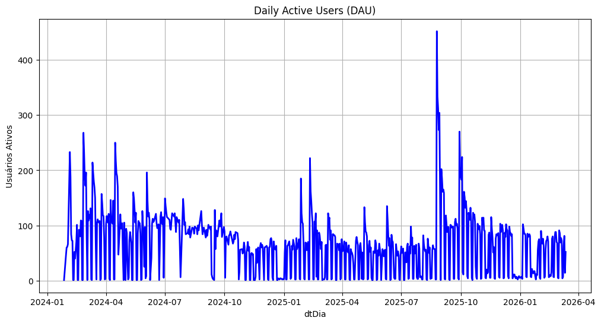
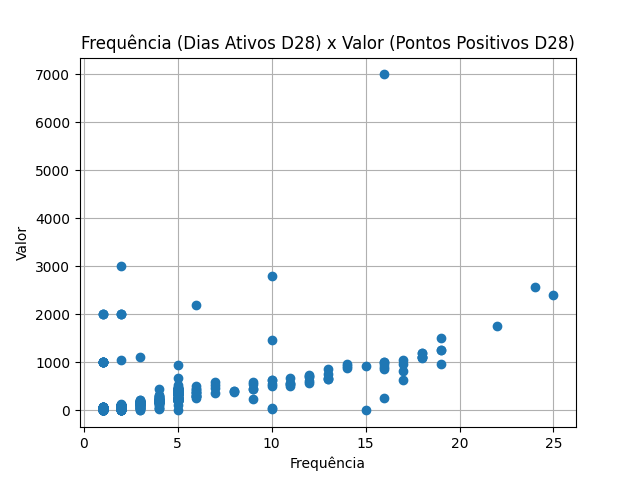
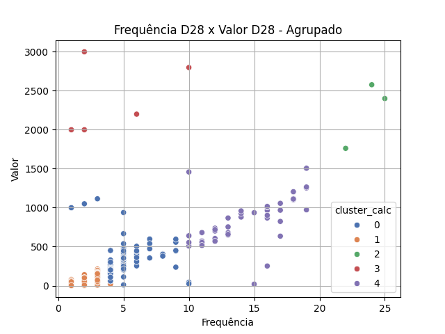
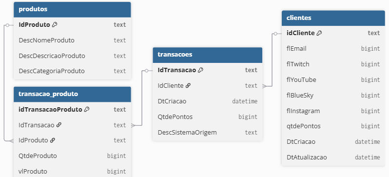
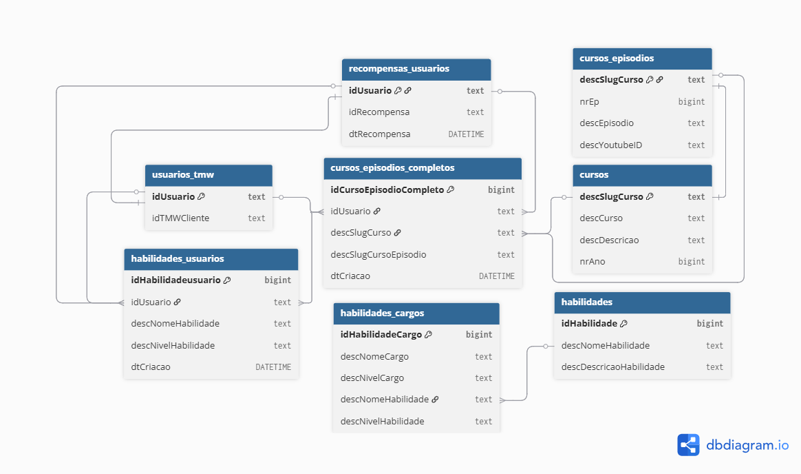

# Loyalty Predict Project

Projeto de Ciência de Dados realizado por Eduardo Ferreira da Silva. 

## Visão Geral do Projeto
Bem vindo ao meu projeto de predição de fidelidade de clientes utilizando dados do canal Teo Me Why da Twitch. Nele o **objetivo** foi construir uma **Tabela Base Analítica** (ABT) e um **modelo** de **aprendizado de máquina** (*machine learning*) para realizar **predições** sobre a **probabilidade** de um **cliente** se tornar **fiel** nos 28 dias seguintes a uma data específica.

Dessa forma, utilizando as características (*features*) construídas do cliente no dia 01/03/2026, por exemplo, é possível determinar a probabilidade dele se tornar fiel no dia 29/03/2026. Para construir e orquestrar essas predições foram utilizadas, principalmente, scripts **Python**, consultas em **SQL** e conhecimentos de **Estatística** e **Aprendizado de Máquina**.

Para desenvolvimento do projeto foi utilizada a metodologia *Cross-Industry Standard Process for Data Mining* (CRISP-DM) que estabelece 6 etapas: 
1. Entendimento do Negócio;
2. Entendimento dos dados;
3. Preparação dos dados;
4. Modelagem;  
5. Validação;
6. Implementação do projeto e acompanhamento.

Além disso, dentro da etapa de modelagem utilizou-se a metodologia *Sample-Explore-Modify-Model-Assess* (SEMMA) desenvolvida pela empresa SAS.

## Questão

A principal questão que pretende-se responder nesse projeto é:

* ``Qual a probabilidade de um cliente se tornar fiel daqui a 28 dias?``

Observação: Um cliente é considerado fiel se realizou ao menos uma transação nos últimos 7 dias considerando uma data específica.

## Ferramentas Utilizadas

Para construção da ABT e do modelo de predição de fidelidade foram utilizadas as seguintes ferramentas:

- **SQL**: entender e analisar os dados do negócio, construir as características dos cliente e criar a Tabela Base Analítica (ABT); 

- **Python**: Orquestrar a criação de tabelas com SQL, possibilitar o treinamento e teste de algoritmos de aprendizado de máquina, automatizar a obtenção de dados atualizados e criar uma *Application Programming Interface* (API) para realizar as predições de fidelidade. Também foram utilizadas, principalmente, as seguintes bibliotecas:  
    - **Biblioteca Pandas**: manipular e preparar dados para a modelagem;
    - **Biblioteca MLflow**: versionar e administrar modelos de aprendizado de máquina; 
    - **Biblioteca SQLAlchemy**: realizar conexões com bancos de dados e realizar consultas;
    - **Biblioteca Flask**: criar uma API para o modelo preditivo;
    - **Biblioteca Requests**: realizar requisições na API criada para o modelo;
    - **Biblioteca Matplotlib**: visualizar dados e estatísticas;
    - **Biblioteca Seaborn**: visualizar gráficos de dispersão com categorias;
    - **Biblioteca Feature_engine**: transformar as características dos clientes para o modelo, imputando valores faltantes, codificando variáveis categóricas e selecionando as características mais relevantes;
    - **Biblioteca Scikit-learn**: modelar o problema com algoritmos de aprendizado de máquina. Alguns dos algoritmos utilizados no caso desse projeto foram:
        - ***Decision Tree Classifier***: busca classificar os clientes em fieis e não fieis por meio de divisões sucessivas, chamados de nós, considerando características da ABT e gerar um *score* de probabilidade para cada uma das classificações;
        - ***Random Forest Classifier***: utiliza um conjunto de *Decision Tree Classifier* com amostras diferentes e combinar suas predições para classificar os clientes em fiéis e não fiéis, gerando *scores* de probabilidade para cada um;
        - ***Adaptive Boosting Classifier***: treina iterativamente modelos base, alterando o peso de cada observação e dando mais importância a aquelas que possuem um erro maior associado com o objetivo de classificar clientes em fieis e não fieis.
 
## Como Utilizar (Para Usuários)

Primeiro passo: 
- get_data

Segundo passo: exec_query:
- cd src/analytics/
- python exec_query.py --table fs_education --db_origin education-platform
- python exec_query.py --table life_cycle
- python exec_query.py --table fs_life_cycle --db_origin analytics --start 2024-03-01
- python exec_query.py --table fs_transacional

Terceiro passo:
- ctrl + shift + q em target.sql
- train.py

Quarto passo:
TODO DIA
- get data
- pipeline_analytics.py

Quinto passo:
- predict_fiel ou api_fiel
ou
- cd src/api/
- flask --app api_fiel run --port 5001
- request_api_fiel


## Entendimento do Negócio

O ecossistema Teo Me Why envolve um sistema de pontos que é movimentado por transações realizadas em troca de produtos virtuais e pelo engajamento nas transmissões ao vivo no canal [Teo Me Why](https://www.twitch.tv/teomewhy) na Twitch e na [plataforma de cursos](https://cursos.teomewhy.org/).

É possível ganhar pontos:
 - Enviando comentários nas transmissões ao vivo;
 - Assistindo as transmissões ao vivo;
 - Assinando uma lista de presença;
 - Completando cursos. 
 
 Com o saldo acumulado pode-se:
 - Comprar itens para um personagem virtual de RPG;
 - Comprar benefícios durante as lives; 
 - Trocar os pontos para obter outro tipo de moeda, utilizada em transações de itens físicos.  

As transmissões ao vivo na Twitch são realizadas de segunda à sexta na parte da manhã com o Teodoro Calvo realizando algum conteúdo relacionado a Tecnologia. Em alguns dias, são marcados cursos ou projetos de Ciência de Dados, sendo esse os dias mais movimentados.

Os vídeos das transmissões ficam salvos na Twitch para assinantes que apoiam o canal de lives. Além disso, os cursos e projetos são editados e postados no YouTube, compondo a plataforma de cursos, a qual é construída utilizando a biblioteca do Python Streamlit e permite que os usuários registrarem seu progresso.
 
Nesse projeto não são analisadas as transações financeiras do ecossistema Teo Me Why, pois o objetivo aqui está relacionado ao engajamento, o qual é inconstante durante o ano e necessita de ações a serem realizadas.

Uma dessas ações é a predição da probabilidade de clientes se tornarem fiéis para que, assim, seja possível tomar ações com o intuito de, por exemplo, aumentar o público que assiste e interage nas transmissões ao vivo semanalmente.

## Entendimento dos Dados

Os dados foram disponibilizados em formato de banco de dados relacional pelo Teodoro Calvo e analisados utilizando SQL com SQLite.

O projeto utiliza dois bancos de dados principais:

- Sistema de Fidelidade
- Plataforma Educacional

### Fontes de Dados

O primeiro banco de dados e mais utilizado é composto por 4 tabelas relacionadas a clientes, produtos, transações do sistema de pontos do canal Teo Me Why na Twitch. 

- **Sistema de Pontos**: [https://www.kaggle.com/datasets/teocalvo/teomewhy-loyalty-system](https://www.kaggle.com/datasets/teocalvo/teomewhy-loyalty-system)


O segundo banco de dados é formado por 8 tabelas relacionadas à plataforma de cursos.

- **Plataforma de Cursos**: [https://www.kaggle.com/datasets/teocalvo/teomewhy-education-platform](https://www.kaggle.com/datasets/teocalvo/teomewhy-education-platform)

Observação: Vale ressaltar que somente 10% da base tem informações cadastradas no segundo banco de dados, assim, sendo menos consultado que o primeiro.

### Análise do Engajamento dos Usuários

A primeira análise realizada tinha o objetivo de identificar se estava acontecendo perda ou ganho de engajamento dos usuários nas transmissões ao vivo do Teo Me Why.

#### Usuários Ativos Diariamente (DAU)

Para isso foi utilizada a métrica de **Usuários Ativos Diariamente (DAU)**, considerando como um usuário ativo aquele que realizou ao menos uma transação no sistema de pontos em um determinado dia.

Para calcular essa métrica, foi utilizada uma consulta em SQL ao banco de dados do sistema de pontos, utilizando :

```SQL
-- DAU: Daily Active Users

-- Seleciona uma coluna que contém apenas a data 
SELECT DATE(DtCriacao) as dtDia,

       -- Conta clientes distintos em uma data (DAU) 
       COUNT(DISTINCT idCliente) as DAU

-- Define a consulta na tabela transacoes 
FROM transacoes

-- Agrupa pela data
GROUP BY dtDia

-- Ordena pela data na ordem ascendente
ORDER BY dtDia  
```

O gráfico da série temporal do DAU gerada por essa consulta é o seguinte:



Entretanto, ao analisar esse gráfico não foi possível perceber uma tendência clara de crescimento ou de queda no engajamento. Isso ocorre porque as transmissões não são feitas de final de semana, o que gera variações de DAU entre dias com e sem atividades, introduzindo um nível alto de ruído na série temporal.

#### Usuários Ativos Mensalmente (MAU)

Por conta dos ruídos gerados no DAU, optou-se por utilizar a métrica de **Usuários Ativos Mensalmente (MAU)**, evitando os ruídos do final de semana. No MAU considerou-se um janela móvel de 28 dias, pois ela contém exatamente 4 vezes cada dia da semana, reduzindo distorções causadas pela sazonalidade semanal.

Para calcular a métrica MAU, foi utilizada a seguinte consulta em SQL:

```SQL
-- MAU: Monthly Active Users

-- Seleciona quais dias cada cliente esteve ativo
WITH tb_daily_users AS (
     
    SELECT DISTINCT 
        DATE(DtCriacao) AS dtDia,
        idCliente
    FROM transacoes

),

-- Constrói tabela com todos os dias da base
tb_reference_day AS (
    
    SELECT DISTINCT 
        dtDia AS dtRef
    FROM tb_daily_users

),

-- Calcula Usuários Mensais Ativos (MAU)
tb_mau AS (

    SELECT t1.dtRef,
           -- Usuários distintos ativos nos últimos 28 dias
           COUNT(DISTINCT t2.idCliente) AS MAU,
           -- Quantidade de dias observados nos últimos 28 dias
           COUNT(DISTINCT t2.dtDia) AS qtdDias
    FROM tb_reference_day AS t1

    LEFT JOIN tb_daily_users AS t2
        ON t2.dtDia <= t1.dtRef
    AND (JULIANDAY(t1.dtRef) - JULIANDAY(t2.dtDia)) < 28

    -- Agrupa pela data de referência
    GROUP BY t1.dtRef

)

SELECT *
FROM tb_mau
ORDER BY dtRef
```

O gráfico da série temporal do MAU, construído com os dados obtidos nessa consulta, pode ser observado abaixo:


#### Interpretação Gráfico da métrica MAU

Ao analisar o gráfico da métrica MAU é possível observar que em alguns meses ocorrem picos no número de Usuários Ativos Mensalmente. Esses aumentos coincidem com períodos em que o canal Teo Me Why está promovendo cursos e projetos. 

Além disso, nota-se uma **tendência de queda** entre **março de 2024 e agosto de 2025**, indicando uma possível redução de engajamento dos usuários nesse período. Em seguida, observa-se um **aumento substancial** no **mês posterior** a essa janela, o que pode estar relacionado com o curso de SQL ministrado pelo Teodoro Calvo, estimulando maior engajamento dos usuários.

Na sequência, identifica-se uma **nova tendência de queda** entre **outubro de 2025 e janeiro de 2026**, sugerindo que que o aumento substancial anterior pode ter sido pontual e atribuído ao sucesso do curso.

Diante deste cenário, torna-se relevante tomar medidas para aumentar o engajamento do público e reverter a tendência de queda observada. 

Nesse contexto, um modelo de aprendizado de máquina capaz de prever os usuários com maior probabilidade de se tornarem fiéis pode auxiliar na definição de ações de Marketing com o intuito de incentivar o engajamento e recorrência desse público.

### Geração dos Gráficos para Análise
Para gerar os gráficos das métricas DAU e MAU e obter os dados foram utilizadas as seguintes bibliotecas:

```Python
import pandas as pd
import sqlalchemy
import matplotlib.pyplot as plt
import seaborn as sns
```

A principal função do script para gerar o gráfico foi a seguinte:

```Python
# Gera um gráfico de série temporal da métrica de Usuários Ativos  
def graph(
        df: pd.DataFrame, 
        x_date: str, 
        y_metric:str, 
        color: str, 
        title: str
):
    
    # Converte a coluna de data para datetime
    df[x_date] = pd.to_datetime(df[x_date])
    
    # Define o tamanho da figura
    plt.figure(figsize=(12,6))
    
    # Cria um gráfico de linha a partir do DataFrame
    sns.lineplot(
        data=df, 
        x=x_date, 
        y=y_metric, 
        linewidth=2, 
        color=color)

    # Configura rótulos e títulos do gráfico 
    plt.xlabel("Data")
    plt.ylabel("Usuários Ativos")
    plt.title(title)

    # Adiciona uma grade ao gráfico
    plt.grid()

    # Exibe o gráfico
    plt.show()
```


O script completo em Python pode ser encontrado em: [src/analytics/dau_mau_graphs.py](src/analytics/dau_mau_graphs.py). 

## Preparação dos Dados

Nessa etapa iniciou-se a construção da Tabela Base Analítica (ABT).

### Metodologia RFV

As primeiras características dos usuários foram construídas utilizando a metodologia Recência, Frequência e Valor (RFV), que buscou segmentar os clientes com base nas métricas de:

- **Recência**: quantidade de dias desde a última transação (ou ativação) do usuário;
-  **Frequência**: quantidade total de transações (ou ativações) em um determinado período;
- **Valor**: valor total das transações de um usuário.

A metodologia RFV foi utilizada para segmentar os clientes e possibilitar a construção do ciclo de vida dos usuários. 

#### Ciclo de Vida dos Usuários e Recência

O ciclo de vida do usuário, a primeira coluna da ABT a ser criada, é uma forma de classificar o comportamento dos consumidores durante a sua jornada com uma marca.

No contexto desse projeto, esse sistema de classificação foi desenvolvido considerando a métrica de Recência, a penúltima ativação e primeira ativação dos clientes. Assim, os estados do Ciclo de Vida de um usuário são:

- **Curioso**: Primeira Ativação $\leq$ 7 dias;
- **Fiel**: Última Ativação $\leq$ 7 dias e Penúltima Ativação $\leq$ 14 dias;
- **Turista**: 8 dias $\leq$ Última Ativação $\leq$ 14 dias;
- **Desencantado**: 15 dias $\leq$ Última Ativação $\leq$ 28 dias;
- **Zumbi**: última Ativação > 28 dias.

Além disso, foram desenvolvidas dois estados de transição entre as classificações anteriores:  

- **Reconquistado**: cliente era Desencantado e voltou a ser Fiel; 
- **Reborn**: cliente era Zumbi e voltou a ser Fiel.

Na consulta, a função de classificação `ROW_NUMBER()` (uma *Window Function*) foi importante para enumerar as linhas de forma decrescente e obter a segunda data mais recente (penúltima transação):

```SQL
-- Tabela auxiliar para calcular a quantidade de dias desde a penúltima transação
tb_rn AS (
  
    SELECT *,
           -- Enumera transações por cliente para permitir extração da penúltima linha 
           ROW_NUMBER() OVER (PARTITION BY idCliente ORDER BY dtDia DESC) AS rnDia
    FROM tb_daily

),

-- Calcula a Recência desde a penúltima transação 
tb_penultima_ativacao AS (

    SELECT *,
           CAST(JULIANDAY('{date}') - JULIANDAY(dtDia) AS INT) AS qtdeDiasPenultimaAtivacao
    FROM tb_rn
    
    WHERE rnDia = 2

),
```
Na classificação do ciclo de vida, foi utilizada a expressão condicional `CASE WHEN`:

```SQL
-- Classifica clientes em estágios do ciclo de vida com base na 1ª transação e na Recência 
tb_life_cycle AS (
    
    SELECT t1.*,
           t2.qtdeDiasPenultimaAtivacao,
           
           -- Regras de classificação do ciclo de vida:
           CASE
               WHEN t1.qtdeDiasPrimTransacao <= 7 THEN 
                        '01-CURIOSO'
                
               WHEN t1.qtdeDiasUltimaAtivacao <= 7 
               AND t2.qtdeDiasPenultimaAtivacao - t1.qtdeDiasUltimaAtivacao <= 14 THEN 
                        '02-FIEL'
                
               WHEN t1.qtdeDiasUltimaAtivacao BETWEEN 8 AND 14 THEN 
                        '03-TURISTA'
                
               WHEN t1.qtdeDiasUltimaAtivacao BETWEEN 15 AND 28 THEN 
                        '04-DESENCANTADO'
                
               WHEN t1.qtdeDiasUltimaAtivacao > 28 THEN 
                        '05-ZUMBI' 
                
               WHEN t1.qtdeDiasUltimaAtivacao <= 7 
               AND t2.qtdeDiasPenultimaAtivacao - t1.qtdeDiasUltimaAtivacao BETWEEN 15 AND 27 THEN 
                        '02-RECONQUISTADO'
                
               WHEN t1.qtdeDiasUltimaAtivacao <= 7 
               AND t2.qtdeDiasPenultimaAtivacao - t1.qtdeDiasUltimaAtivacao >= 28 THEN
                        '02-REBORN'
           END AS descLifeCycle
    
    FROM tb_idade AS t1

    LEFT JOIN tb_penultima_ativacao AS t2
        ON t1.idCliente = t2.idCliente

),
```

O código completo pode ser encontrado em: [src/analytics/life_cycle.sql](src/analytics/life_cycle.sql).


#### Frequência e Valor

Com o intuito criar uma segmentação dentro de cada etapa do ciclo de vida, foi utilizada uma consulta SQL para criar uma tabela com as métricas de frequência e valor de cada usuário, considerando uma janela de 28 dias 

Consulta SQL Completa: [src/analytics/frequencia_valor.sql](src/analytics/frequencia_valor.sql);

Após a consulta, utilizou-se um script Python para análise, visualização e segmentação baseada nos dados. 

Buscando uma visualização inicial, criou-se um gráfico de dispersão de Frequência por Valor, considerando os dados do dia primeiro de setembro de 2025 (um período ativo da base):



Com o gráfico foi possível identificar um outlier com bem mais de 4 mil pontos positivos, o qual foi retirado dos dados para não prejudicar o agrupamento.

Para realizar uma segmentação dentro de cada etapa do ciclo de vida, os dados foram inicialmente padronizados para uma escala entre 0 e 1. 

Em seguida, foi aplicado o algoritmo K-Means, que realiza o agrupamento com base na proximidade dos dados em relação as médias de cada grupo.

Com o resultado obtido, construiu-se o seguinte gráfico:



Script Python Completo: [src/analytics/frequencia_valor.py](src/analytics/frequencia_valor.py).

Baseado no agrupamento realizado pelo algoritmo, definiu-se os seguintes segmentos:
 
- **22-Eficientes**: Frequência > 10 e Valor $\leq$ 1500;
- **20-Potencial**: Frequência > 10 e Valor $\leq$ 750;
- **21-Esforçados**: Frequência > 10 e Valor 750 $\leq$ Valor $\leq$ 1500;
- **12-Hypers**: Frequência $\leq$ 10 e Valor $\geq$ 1500;
- **10-Indecisos**: Frequência <= 10 e 750 $\leq$ Valor $\leq$ 1500;
- **01-Preguiçoso**: 5 $\leq$ Frequência $\leq$ 10 e Valor $\leq$ 750;
- **00-Lurker**: Frequência < 5 e Valor $\leq$ 750.
  
Na sequência, definiu-se essa segmentação na consulta do ciclo de vida:
[src/analytics/life_cycle.sql](src/analytics/life_cycle.sql).

### Construção de Features Baseadas no Ciclo de Vida

Com o objetivo de identificar quais características do comportamento dos usuários ao longo do ciclo de vida são mais relevantes para a predição de fidelidade, foi desenvolvida uma *feature store* específica para esse contexto.

Essa *feature store* concentra variáveis que capturam tanto o estado atual quanto o histórico recente do cliente, além de métricas agregadas por grupo, permitindo melhores análises comparativas.

As variáveis categóricas criadas foram as seguintes:
- **qtdeFrequencia**: número de dias em que o cliente esteve ativo nos últimos 28 dias (D28);
- **descLifeCycleAtual**: estágio atual do cliente no ciclo de vida;
- **descClusterAtual**: segmentação atual do cliente; 
- **descLifeCycleD28**: estágio do cliente no ciclo de vida há 28 dias;
- **descClusterD28**: segmentação há 28 dias.

Já as variáveis relacionadas à distribuição histórica no Ciclo de Vida foram:
- **pctCurioso**: porcentagem do tempo em que o cliente esteve no estado "Curioso";
- **pctFiel**: porcentagem do tempo em que esteve como "Fiel";
- **pctTurista**: porcentagem do tempo como "Turista";
- **pctDesencantado**: porcentagem do tempo como "Desencantado";
- **pctZumbi**: porcentagem do tempo como "Zumbi";
- **pctReconquistado**: porcentagem do tempo como "Reconquistado";
- **pctReborn**: porcentagem do tempo como "Reborn".

Enquanto as variáveis relacionadas a métricas comparativas por grupo foram:
- **avgFreqGrupo**: média de dias ativos (D28) dos clientes de um mesmo estágio do ciclo de vida;
- **ratioFreqGrupo**: razão entre a frequência do cliente e a média do grupo. 

As *features* categóricas foram construídas pensando em como o comportamento do cliente mais recente no ciclo de vida, pode influenciar a sua futura fidelidade.

Já as variáveis de porcentagem (pct*) capturam a distribuição do cliente ao longo dos diferentes estágios do ciclo de vida, permitindo uma análise de seu comportamento ao longo do tempo.

Por último, observar a frequência do cliente em comparação com o seu grupo pode mostrar clientes que tem uma tendência maior a se tornar fiel.

A consulta SQL completa para a construção dessa *feature store* pode ser encontrado em: [src/analytics/fs_life_cycle.sql](src/analytics/fs_life_cycle.sql).

### Construção de Features Baseadas nas Transações

Como as transações refletem o engajamento dos clientes com as transmissões, foi estruturada uma *feature store* para capturar diferentes dimensões do comportamento do cliente, incluindo tempo de relacionamento, frequência, intensidade de uso, recorrência e valor ao longo de diferentes janelas (Vida, D7, D14, D28, D56).

Essa abordagem permite representar tanto o volume quanto a regularidade das interações, aspectos fundamentais para modelagem de fidelidade dos clientes.

A primeira *feature* captura a duração do relacionamento do cliente com as transmissões ao vivo do Teo Me Why, permitindo diferenciar usuários mais novos e mais antigos na base:
- idadeDias: número de dias desde o cadastro do cliente na base.

Em seguida, foram criadas *features* para mensurar a frequência dos clientes ao longo do tempo, o que pode ajudar a identificar mudanças de comportamento:
- **qtdeAtivacaoVida**: total de dias ativos do cliente desde o seu cadastro na base;
- **qtdeAtivacaoD7**: total de dias ativos nos últimos 7 dias;
- **qtdeAtivacaoD14**: total de dias ativos nos últimos 14 dias;
- **qtdeAtivacaoD28**: total de dias ativos nos últimos 28 dias;
- **qtdeAtivacaoD56**: total de dias ativos nos últimos 56 dias.

Também foram criadas *variáveis* para capturar a intensidade da atividade dos clientes, ou seja, o nível de engajamento de cada um:
- **qtdeTransacaoVida**: quantidade de transações do cliente desde o seu cadastro;
- **qtdeTransacaoD7**: quantidade de transações nos últimos 7 dias;
- **qtdeTransacaoD14**: quantidade de transações nos últimos 14 dias;
- **qtdeTransacaoD28**: quantidade de transações nos últimos 28 dias;
- **qtdeTransacaoD56**: quantidade de transações nos últimos 56 dias.

Calculou-se o saldo líquido de pontos (ganhos - gastos), os pontos positivos (ganhos) e os pontos negativos (gastos) em diferentes janelas temporais:
- Saldo:
    - **saldoVida**: saldo de pontos atual do cliente;
    - **saldoD7**: saldo de pontos considerando os último 7 dias;
    - **saldoD14**: saldo de pontos considerando os último 14 dias;
    - **saldoD28**: saldo de pontos considerando os último 28 dias;
    - **saldoD56**: saldo de pontos considerando os último 56 dias.
- Pontos positivos:    
    - **qtdePontosPosVida**: total de pontos positivos do cliente desde o seu cadastro;
    - **qtdePontosPosD7**: total de pontos positivos nos últimos 7 dias;
    - **qtdePontosPosD14**: total de pontos positivos nos últimos 14 dias;
    - **qtdePontosPosD28**: total de pontos positivos nos últimos 28 dias;
    - **qtdePontosPosD56**: total de pontos positivos nos últimos 56 dias.
- Pontos negativos:
    - **qtdePontosNegVida**: total de pontos negativos do cliente desde o seu cadastro;
    - **qtdePontosNegD7**: total de pontos negativos nos últimos 7 dias;
    - **qtdePontosNegD14**: total de pontos negativos nos últimos 14 dias;
    - **qtdePontosNegD28**: total de pontos negativos nos últimos 28 dias;
    - **qtdePontosNegD56**: total de pontos negativos nos últimos 56 dias.

Outras *features* criadas tem relação com as transações realizadas de manhã (das 7:00 às 11:59), de tarde (das 12:00 às 18:00) e de noite (18:00 às 06:59):
- Quantidade por período:
    - **qtdeTransacaoManha**: total de transações realizadas pelo cliente no período da manhã;
    - **qtdeTransacaoTarde**: total de transações realizadas no período da tarde;
    - **qtdeTransacaoNoite**: total de transações realizadas no período da noite;
- Percentual por período:
    - **pctTransacaoManha**: percentual de transações realizadas de manhã pelo cliente; 
    - **pctTransacaoTarde**: percentual de transações realizadas de tarde; 
    - **pctTransacaoNoite**: percentual de transações realizadas de noite.

Criou-se *features* que dizem respeito a média de transações por dia ativo em diferentes janelas temporais: 
- **qtdeTransacaoDiaVida**: média de transações do cliente por dia ativo desde o cadastro na base; 
- **qtdeTransacaoDiaD7**: média de transações por dia ativo, considerando os últimos 7 dias; 
- **qtdeTransacaoDiaD14**: média de transações por dia ativo, considerando os últimos 14 dias; 
- **qtdeTransacaoDiaD28**: média de transações por dia ativo, considerando os últimos 28 dias; 
- **qtdeTransacaoDiaD56**: média de transações por dia ativo, considerando os últimos 56 dias.

Calculou-se também o quanto cada cliente contribuiu para o MAU mais próximo do cálculo:
- **pctAtivacaoMAU**: percentual de dias ativos no últimos 28 dias.

Outras *features* desenvolvidas estão relacionadas com o tempo das transmissões ao vivo assistido por cada cliente, considerando diferentes janelas temporais:
- **qtdeHorasVida**: total de horas assistidas desde o cadastro na base; 
- **qtdeHorasD7**: total de horas assistidas nos últimos 7 dias; 
- **qtdeHorasD14**: total de horas assistidas nos últimos 14 dias;
- **qtdeHorasD28**: total de horas assistidas nos últimos 28 dias;
- **qtdeHorasD56**: total de horas assistidas nos últimos 56 dias.

A recorrência de uso foi capturada por meio de duas *features* que consideram o intervalo de dias ativos do cliente: 
- **avgIntervaloDiasVida**: intervalo médio, em dias, que um usuário demora para retornar as transmissões ao vivo desde o cadastro na base;
- **avgIntervaloDiasD28**: intervalo médio, em dias, que um usuário demora para retornar as transmissões ao vivo, considerando os últimos 28 dias.

Por fim, as últimas variáveis diziam respeito ao total de transações de cada um dos seguintes itens:
- **qtdeChatMessage**;
- **qtdeAirflowLover**;
- **qtdeRLover**;
- **qtdeListaPresenca**;
- **qtdePresencaStreak**;
- **qtdeTrocaDePontosStreamElements**;
- **qtdeReembolsoTrocaDePontosStreamElements**;
- **qtdeRpg**;
- **qtdeChurnModel**.

Em conjunto, essas *features* permitem uma visão mais completa do comportamento do cliente, pois combina diferentes janelas temporais e métricas comportamentais. Essa diversidade de variavéis pode aumentar a capacidade de modelo de predição de capturar os padrões que levam a fidelidade de um cliente. 

A consulta SQL utilizada na *feature store* transacional pode ser encontrada em: [src/analytics/fs_transacional.sql](src/analytics/fs_transacional.sql)

### Construção de Features Baseadas na Plataforma de Cursos

Considerando que não apenas as interações durante as tranmissões podem impactar a fidelidade, foi construída uma *feature store* com variáveis relacionadas ao engajamento na plataforma de cursos.

As primeiras *features* desenvolvidas estão relacionadas a conclusão dos cursos na plataforma por cada cliente:
- qtdeCursosCompletos: total de cursos concluídos pelo cliente;
- qtdeCursosIncompletos: total de cursos não concluídos pelo cliente.

Além disso, foram desenvolvidas *features* que captam a porcentagem de progresso dos clientes nos cursos e projetos da plataforma:
- carreira;
- coletaDados2024;
- dsDatabricks2024;
- dsPontos2024;
- estatistica2024;
- estatistica2025;
- github2024;
- github2025;
- go2026;
- iaCanal2025;
- lagoMago2024;
- loyaltyPredict2025;
- machineLearning2025;
- matchmakingTramparDeCasa2024;
- ml2024;
- mlflow2025;
- nekt2025;
- pandas2024;
- pandas2025;
- plataformaMl2026;
- python2024;
- python2025;
- speedF1;
- sql2020;
- sql2025;
- streamlit2025;
- tramparLakehouse2024;
- tseAnalytics2024.

Por último, foi desenvolvida uma *feature* relacionada a atividade do cliente na plataforma:
- qtdDiasUltimaAtiv: total de dias desde a última ativação na plataforma de cursos.

Esse conjunto de *features* foi desenvolvido com base na hipótese de que o uso da plataforma de cursos pode influenciar a fidelidade dos clientes. Assim, apesar de apenas cerca de 10% da base utilizar a plataforma, essa parcela poderia ter uma maior propensão a engajar com frequência nas transmissões ao vivo do canal Teo Me Why.

A consulta SQL utilizada nessa feature store pode ser encontrada em:
[src/analytics/fs_education.sql](src/analytics/fs_education.sql).

### Criação da Analytical Base Table (ABT)

aaaa

## Modelagem
SEMMA

## Avaliação 

## Deploy

## What I Learned
aaaa

## Insights

## Challenges I Faced

## Conclusion


## Ações

- Métricas gerais do TMW;
- Definição do Ciclo de Vida dos usuários;
- Análise de Agrupamento dos diferentes perfís de usuários;
- Criar modelo de Machine Learning que detecte a perda ou ganho de engajamento;
- Incentivo por meio de pontos para usuários mais engajados;

## Etapas

- Entendimento do negócio;
- Extração dos dados;
- Entendimento dos dados;
- Definição das variáveis;
- Criação das Feature Stores;
- Treinamento do modelo;
- Registro do modelo no MLFlow;
- Criação de App para Inferência em Tempo Real;
- Integração com Ecossistema TMW;

## Informações Extras

### Banco de Dados do Sistema de Fidelidade

O esquema do banco de dados do sistema de fidelidade é o seguinte:



### Banco de Dados da Plataforma de Educação
Já o esquema do banco de dados da plataforma de educação é o seguinte:


